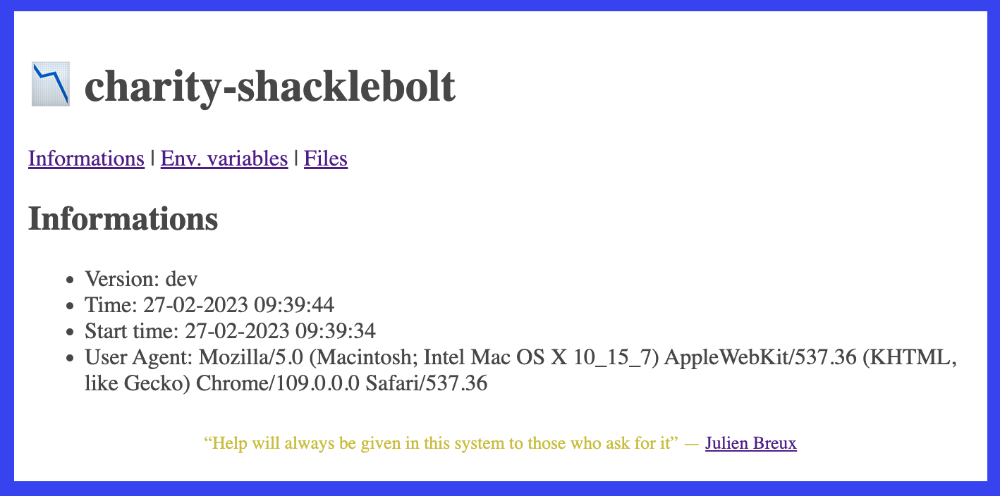
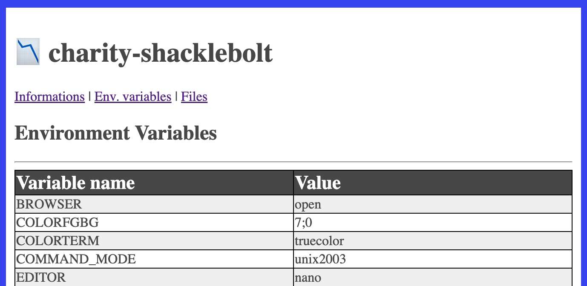
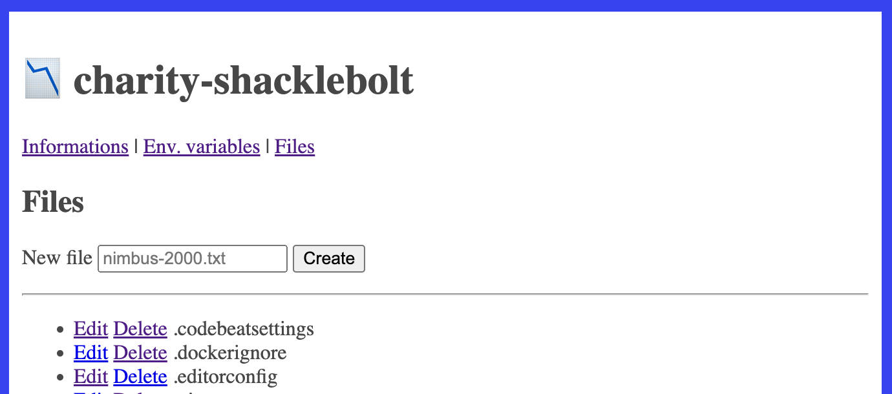
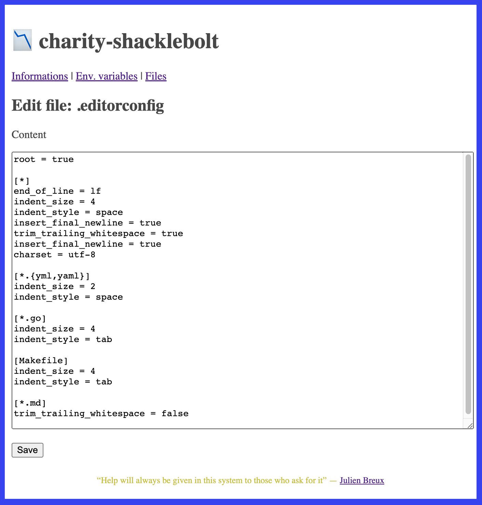

## ⚡️ Potter

⚡️ Potter is an image for educational purposes and to test the behavior of the infrastructure.  

The main idea is very simple:  
When something happens that you don't understand on a development, staging or production environment... you use ⚡️ Potter.

---

[](https://github.com/JulienBreux/potter/actions)
[](https://goreportcard.com/report/github.com/JulienBreux/potter)
[](https://codebeat.co/projects/github-com-JulienBreux-potter-main)
[](http://godoc.org/github.com/JulienBreux/potter)
[](Tag)
[](https://golang.org/dl/#stable)
[](https://github.com/JulienBreux/potter/blob/main/LICENSE)
[](https://github.com/JulienBreux/potter/releases)

---

### Images

__Github:__

```
docker pull ghcr.io/julienbreux/potter:latest
```

__Docker Hub:__

```
docker pull julienbreux/potter:latest
```

---

### Examples








